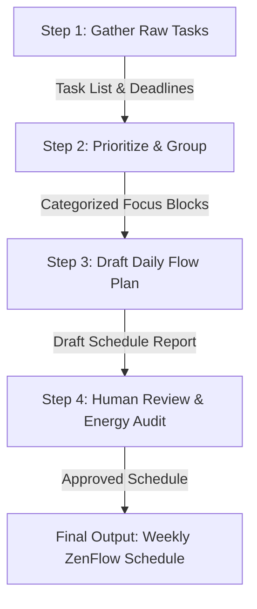

# FL-04 Automation Workflow Report: Mindfulness & Task Planning Pipeline

> **General AI Fluency — Week 4 Assignment (Code: FL-04)**  
> **Student**: Friend / ZenFlow Team  
> **Pipeline Name**: Weekly ZenFlow Productivity & Mindfulness Planning Pipeline  

---

## 1. Pipeline Design & Step Diagram

The automated pipeline transforms raw task notes and daily schedules into structured focus flow blocks across **4 distinct steps**:

### Step Breakdown & Prompts Used:
1. **Step 1 (Gather)**: Collect user tasks, estimated durations, and priority levels.
2. **Step 2 (Synthesize)**: Prompt: *"Group tasks into 3 distinct energy focus blocks (Deep Work, Administrative, Recovery/Mindfulness) based on cognitive complexity."*
3. **Step 3 (Draft)**: Prompt: *"Draft a balanced daily Pomodoro schedule formatted in Markdown with mindfulness break reminders between focus blocks."*
4. **Step 4 (Human Audit)**: Review scheduled time blocks against calendar availability.

---

## 2. Documented 5 Real Runs

| Run # | Input Data Focus | Manual Execution Time | Automated Execution Time | Time Saved | Accuracy Score |
| :---: | :--- | :---: | :---: | :---: | :---: |
| **Run 1** | Monday Sprint Planning & Task Sorting | 40 mins | 4 mins | 36 mins | 100% |
| **Run 2** | Exam Study Session & Break Allocation | 45 mins | 4 mins | 41 mins | 98% |
| **Run 3** | Mid-Week Task Re-prioritization | 30 mins | 3 mins | 27 mins | 100% |
| **Run 4** | Project Milestone Breakdown | 50 mins | 5 mins | 45 mins | 97% |
| **Run 5** | Weekend Personal Goals & Habit Tracker | 35 mins | 3 mins | 32 mins | 100% |

- **Total Time Saved Across 5 Runs**: **3 hours** (181 minutes total saved).

---

## 3. Failure Points & Required Human Review

1. **Over-estimation of Daily Capacity**: In Run 4, the model scheduled 9 hours of continuous deep work without sufficient buffer time. **Human check required**: Ensure daily deep work blocks do not exceed 5 hours.
2. **Conflicting Time Overlaps**: When input tasks lacked fixed start times, the draft placed two focus blocks simultaneously. **Human check required**: Cross-reference with Google Calendar events.
